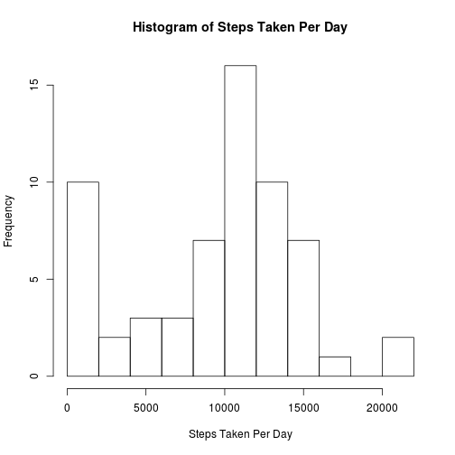
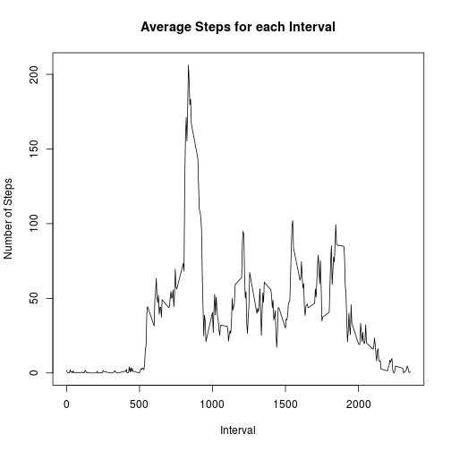
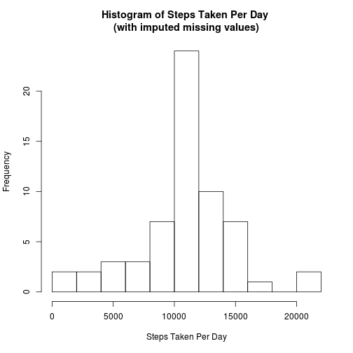
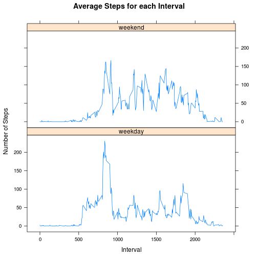

## Loading and preprocessing the data
Using the read.csv() method, we will load the accompanying data, assuming you have cloned this repository as-is.

```r
activity <- read.csv('./activity.csv')
```
Let us examine the loaded data:

```r
str(activity)
```

```
## 'data.frame':	17568 obs. of  3 variables:
##  $ steps   : int  NA NA NA NA NA NA NA NA NA NA ...
##  $ date    : Factor w/ 61 levels "2012-10-01","2012-10-02",..: 1 1 1 1 1 1 1 1 1 1 ...
##  $ interval: int  0 5 10 15 20 25 30 35 40 45 ...
```

```r
summary(activity)
```

```
##      steps                date          interval     
##  Min.   :  0.00   2012-10-01:  288   Min.   :   0.0  
##  1st Qu.:  0.00   2012-10-02:  288   1st Qu.: 588.8  
##  Median :  0.00   2012-10-03:  288   Median :1177.5  
##  Mean   : 37.38   2012-10-04:  288   Mean   :1177.5  
##  3rd Qu.: 12.00   2012-10-05:  288   3rd Qu.:1766.2  
##  Max.   :806.00   2012-10-06:  288   Max.   :2355.0  
##  NA's   :2304     (Other)   :15840
```
Notice there is a large number of NA's in the steps (2304). We will need to keep this in mind in our analysis going forward.  

## What is mean total number of steps taken per day?  
The first ask is to plot a histogram of total steps taken per day. Before we can do that, we must first calculate the total steps taken per day while ignoring the 2304 missing values.

```r
total.steps.per.day <- tapply(activity$steps, activity$date, sum, na.rm=TRUE)
hist(total.steps.per.day, breaks=10, main='Histogram of Steps Taken Per Day',
     xlab='Steps Taken Per Day')
```

 

Next, let us look at the mean and median of steps per day

```r
mean.steps <- mean(total.steps.per.day)
median.steps <- median(total.steps.per.day)
```
The mean steps per day is 9354.2295082, and the median steps per day is 10395.  

## What is the average daily activity pattern?
First, we average the steps taken for each interval across all days. To help witht he data manipulation, we will use the dplyr package.

```r
library(dplyr)
ave.steps.interval <- activity %>%
    group_by(interval) %>%
    summarise(ave.steps=mean(steps, na.rm=TRUE))
```

We can now make the time series plot.

```r
plot(x=ave.steps.interval$interval, y=ave.steps.interval$ave.steps, type='l',
     main="Average Steps for each Interval", xlab="Interval",
     ylab="Number of Steps")
```

 

To find the interval with the highest average steps taken, we can use the which.max() function.

```r
max.step.interval.number <- which.max(ave.steps.interval$ave.steps)
max.step.interval.minute <- ave.steps.interval$interval[max.step.interval.number]
max.steps <- ave.steps.interval$ave.steps[max.step.interval.number]
```

5-minute interval number 104 which starts on the 835th minute contains the maximum average number of 206.1698113 steps on average.  

## Imputing missing values
There are multiple ways we can calculate the number of rows with missing values for steps. The simplest would be to use the summary() function on the data frame.

```r
summary(activity)
```

```
##      steps                date          interval     
##  Min.   :  0.00   2012-10-01:  288   Min.   :   0.0  
##  1st Qu.:  0.00   2012-10-02:  288   1st Qu.: 588.8  
##  Median :  0.00   2012-10-03:  288   Median :1177.5  
##  Mean   : 37.38   2012-10-04:  288   Mean   :1177.5  
##  3rd Qu.: 12.00   2012-10-05:  288   3rd Qu.:1766.2  
##  Max.   :806.00   2012-10-06:  288   Max.   :2355.0  
##  NA's   :2304     (Other)   :15840
```

There are 2304 rows with NA's.  

To impute missing values, we will use the mean number of steps taken for that interval across all the days. We will take advantage of the average steps for each interval we derived from the previous section and merge the original activity data frame with the average steps for each interval data frame. We then replace any NA's in the "steps" column with the merged average value for that interval.  

```r
activity.imputed <- merge(activity, ave.steps.interval, by=c("interval")) %>%
    mutate(steps = ifelse(is.na(steps), ave.steps, steps)) %>%
    select(-ave.steps)
```

We will now build a new histogram with the missing values imputed. First, we calcualte the new total steps per day, and then we make the plot.

```r
total.steps.per.day.imputed <- tapply(activity.imputed$steps, activity.imputed$date, sum)
hist(total.steps.per.day.imputed, breaks=10, main='Histogram of Steps Taken Per Day \n(with imputed missing values)',
     xlab='Steps Taken Per Day')
```

 

To calculate the new mean and median values:  

```r
mean.steps.imputed <- mean(total.steps.per.day.imputed)
median.steps.imputed <- median(total.steps.per.day.imputed)
```

The mean steps per day with NA's imputed is 1.0766189 &times; 10<sup>4</sup>, and the median steps per day is 1.0766189 &times; 10<sup>4</sup>.  

## Are there differences in activity patterns between weekdays and weekends?
To determine if the date is a weekday or a weekend, we must first convert the date column form a factor to a POSIXt or Date class. Since the "date"" column is date values only with no time, we will use the Date class. We can then use the weekdays() function to determine the day of the week, and use regular expressions to find Saturdays and Sundays.

```r
activity.day.of.week <- activity.imputed %>%
    mutate(date = as.Date(date)) %>%
    mutate(day.of.week = weekdays.Date(date, abbreviate=TRUE)) %>%
    mutate(day.type=ifelse(grepl("Sat|Sun", day.of.week), "weekend", "weekday")) %>%
    mutate(day.type=as.factor(day.type))
```

Then we can find the average number of steps for each inteval over all days.

```r
ave.steps.interval.weekday.end <- activity.day.of.week %>%
    group_by(day.type, interval) %>%
    summarise(ave.steps=mean(steps))
```

Now we can make the time series plot for weekdays vs. weekends usign the lattice package.

```r
library(lattice)
xyplot(ave.steps~interval | day.type, data=ave.steps.interval.weekday.end, type='l',
     main="Average Steps for each Interval", xlab="Interval",
     ylab="Number of Steps", layout=c(1,2))
```

 
